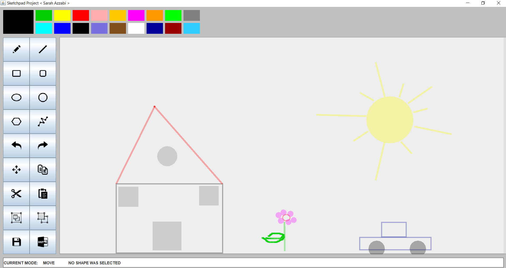

# skitchpad-using-java
A desktop drawing application that was developed using Java s' JWT and Swing APIs, and it allows users to draw basic shapes on the canvas and perform some editing tasks like copy, cut, paste, undo, redo, group, and ungroup shapes. I have constructed the application's code using the OOP programming paradigm and MVC Design Pattern.
 
 

   

 
 
